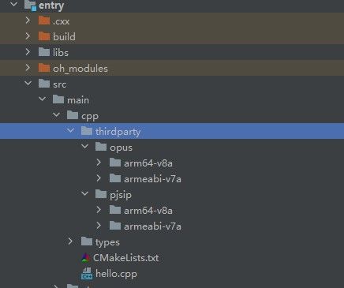
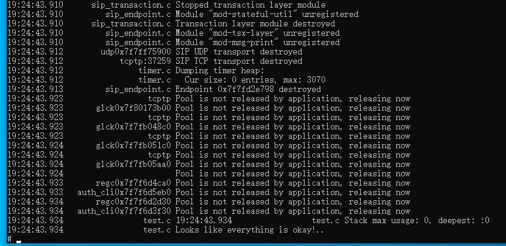

# pjsip集成到应用hap
本库是在RK3568开发板上基于OpenHarmony3.2 Release版本的镜像验证的，如果是从未使用过RK3568，可以先查看[润和RK3568开发板标准系统快速上手](https://gitee.com/openharmony-sig/knowledge_demo_temp/tree/master/docs/rk3568_helloworld)。
## 开发环境
- [开发环境准备](../../../docs/hap_integrate_environment.md)
## 编译三方库
- 下载本仓库
  ```
  git clone https://gitee.com/openharmony-sig/tpc_c_cplusplus.git --depth=1
  ```
- 三方库目录结构
  ```
  tpc_c_cplusplus/thirdparty/pjsip  #三方库pjsip的目录结构如下
  ├── docs                          #三方库相关文档的文件夹
  ├── HPKBUILD                      #构建脚本
  ├── HPKCHECK                      #自动化测试脚本
  ├── OAT.xml                       #OAT开源审查文本
  ├── pjsip_oh_pkg.patch            #编译patch
  ├── README.OpenSource             #说明三方库源码的下载地址，版本，license等信息
  ├── README_zh.md                  #三方库说明文档
  └── SHA512SUM                     #校验文档
  ```
  
- 进入lycium目录下
  ```
  cd tpc_c_cplusplus/lycium
  ```
- 在lycium目录下编译三方库 
  pjsip库需要依赖opus库，所以在build时需要编译pjsip库和opus库
  编译环境的搭建参考[准备三方库构建环境](../../../lycium/README.md#1编译环境准备)
  ```
  ./build.sh pjsip (默认编译依赖库)
  ```
- 三方库头文件及生成的库
  在lycium目录下会生成usr目录，该目录下存在已编译完成的32位和64位三方库
  ```
  pjsip/arm64-v8a   pjsip/armeabi-v7a
  opus/arm64-v8a   opus/armeabi-v7a
  ```

- [测试三方库](#测试三方库)

## 应用中使用三方库

- 在IDE的cpp目录下新增thirdparty目录，将编译生成的库拷贝到该目录下，如下图所示
  
&nbsp;

- 在最外层（cpp目录下）CMakeLists.txt中添加如下语句
  ```
  # 将三方库的头文件加入工程中
  target_include_directories(entry PRIVATE ${CMAKE_CURRENT_SOURCE_DIR}/thirdparty/pjsip/${OHOS_ARCH}/include/)

  # 设置对应的配置项
  target_compile_definitions(entry PUBLIC -DPJ_AUTOCONF=1  -DPJ_IS_BIG_ENDIAN=0 -DPJ_IS_LITTLE_ENDIAN=1)
  
  # 将三方库加入工程中
  target_link_directories(entry PUBLIC ${CMAKE_CURRENT_SOURCE_DIR}/thirdparty/pjsip/${OHOS_ARCH}/lib ${CMAKE_CURRENT_SOURCE_DIR}/thirdparty/opus/${OHOS_ARCH}/lib)
  if(${OHOS_ARCH} STREQUAL "arm64-v8a")
    target_link_libraries(entry PUBLIC pjsua2-aarch64-unknown-linux-gnu pjsua-aarch64-unknown-linux-gnu pjsip-ua-aarch64-unknown-linux-gnu
          pjsip-simple-aarch64-unknown-linux-gnu pjsip-aarch64-unknown-linux-gnu pjmedia-codec-aarch64-unknown-linux-gnu pjmedia-aarch64-unknown-linux-gnu
          pjmedia-videodev-aarch64-unknown-linux-gnu pjmedia-audiodev-aarch64-unknown-linux-gnu pjmedia-aarch64-unknown-linux-gnu pjnath-aarch64-unknown-linux-gnu
          pjlib-util-aarch64-unknown-linux-gnu pj-aarch64-unknown-linux-gnu srtp-aarch64-unknown-linux-gnu resample-aarch64-unknown-linux-gnu
          gsmcodec-aarch64-unknown-linux-gnu speex-aarch64-unknown-linux-gnu ilbccodec-aarch64-unknown-linux-gnu g7221codec-aarch64-unknown-linux-gnu
          yuv-aarch64-unknown-linux-gnu  opus)
  elseif(${OHOS_ARCH} STREQUAL "armeabi-v7a")
    target_link_libraries(entry PUBLIC pjsua2-arm-unknown-linux-gnu pjsua-arm-unknown-linux-gnu pjsip-ua-arm-unknown-linux-gnu
          pjsip-simple-arm-unknown-linux-gnu pjsip-arm-unknown-linux-gnu pjmedia-codec-arm-unknown-linux-gnu pjmedia-arm-unknown-linux-gnu
          pjmedia-videodev-arm-unknown-linux-gnu pjmedia-audiodev-arm-unknown-linux-gnu pjmedia-arm-unknown-linux-gnu pjnath-arm-unknown-linux-gnu
          pjlib-util-arm-unknown-linux-gnu pj-arm-unknown-linux-gnu srtp-arm-unknown-linux-gnu resample-arm-unknown-linux-gnu
          gsmcodec-arm-unknown-linux-gnu speex-arm-unknown-linux-gnu ilbccodec-arm-unknown-linux-gnu g7221codec-arm-unknown-linux-gnu
          yuv-arm-unknown-linux-gnu  opus)
  else()
    message("not support Architecture")
  endif()
  ```

## 测试三方库
三方库的测试使用原库自带的测试用例来做测试，[准备三方库测试环境](../../../lycium/README.md#3ci环境准备)

- 将编译生成的可执行文件及生成的动态库准备好

- 将准备好的文件推送到开发板，进入到构建的目录pjsip-arm64-v8a-build(32位在pjsip-armeabi-v7a-build)下执行make selftest

&nbsp;

## 参考资料
- [润和RK3568开发板标准系统快速上手](https://gitee.com/openharmony-sig/knowledge_demo_temp/tree/master/docs/rk3568_helloworld)
- [OpenHarmony三方库地址](https://gitee.com/openharmony-tpc)
- [OpenHarmony知识体系](https://gitee.com/openharmony-sig/knowledge)
- [通过DevEco Studio开发一个NAPI工程](https://gitee.com/openharmony-sig/knowledge_demo_temp/blob/master/docs/napi_study/docs/hello_napi.md)
